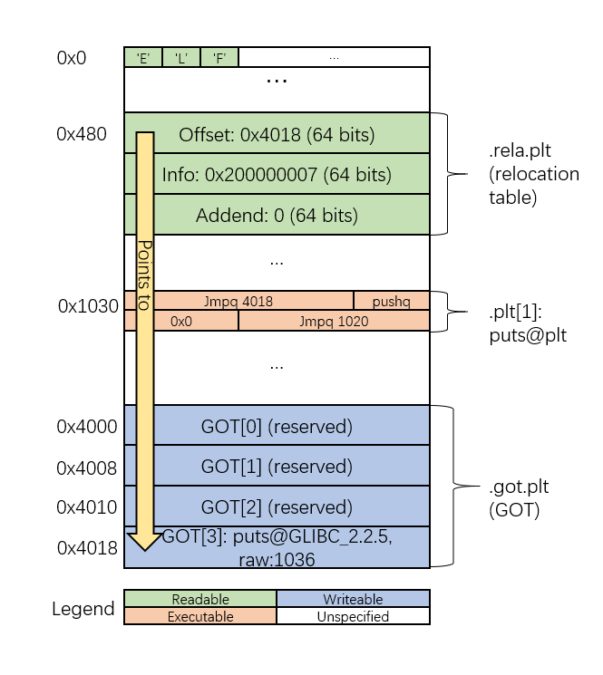

## Step-by-step instruction

Greetings! This guide will show you the basics of this project, and how to finish it:)
<!-- TODO: more smooth intro -->
<!-- TODO: Maybe I should break the instruction for each test case -->
### Goals
As you may learn from CS:APP Chapter 7, this project is a minimal simulation of the vital part of a operating system, a dynamic
loader, which load shared objects(libraries) into process memory. 

Unlike the fully-functional loader, here we mainly focus on loading libraries on demand, *i.e.*, like `dlopen`.

This task can be simply broken up into three orthogonal parts: 
- Locate and load the library needed, as well as its dependencies
- Relocate the symbols for all the libraries loaded 
- Call the constructors of those libraries

You can find out the code doing these things at `src/OpenLibrary.c`, and the structure is pretty clear.

### Getting Started
First of all, you need a Linux environment to finish this project.
This could be a WSL(Windows Subsystem for Linux), a virtual machine, or a desktop/server version of any Linux distribution.
No further libraries are needed.

**Update**: Make sure that you are using a 64-bit Linux system, because in this project we assume that a pointer has 
a length of 8 bytes. If you are already using a 32-bit OS, you will be able to see some warnings when trying to `make`
(otherwise none).
**Please do not ignore that and get a 64-bit OS.** 

However, due to the various implementations of linker on those distributions, the shared libraries produced by them will 
have minor differences. This will **NOT** cause problems when you trying to finish this project, but **will** cause me 
some problems when verifying your submissions, because your code is only tested under your environment.

Thus, it is highly recommended to use Ubuntu 18.04 or 20.04, where you can have the exact environment with me. Yet you can
use a different distribution if you really want that, and in that case please send me your environment and settings.

If you never use Linux before, that's OK. You can always use a virtual machine.
<!-- TODO: add installing Linux, a link or another tutorial -->

### Background
On Linux, dynamic libraries are compiled into ELF(Executable and Linkable) format. You can find out how it is organized by 
simple Googling. 

<!-- 'functional' isn't precise enough -->
Basically, its minimum functional unit is call *section*, which starts with a '.', like '.text' and '.data'.
Each section has their own functionality, for example, '.text' contains the code of this library and '.data' is for global data.
You can find more about ELF at: https://www.ics.uci.edu/~aburtsev/238P/hw/hw3-elf/hw3-elf.html

Several sections together are recongnized by the loader, called *segment*. It is the loader's job to process every segment of 
a library and decide how to deal with them. For example, the loader needs to load a segment whose flag is `PT_LOAD` into memory.

There are some useful commands you can use to inspect a library:
```bash
# need to install binutils first
# print each program header of a library
$ readelf -l ./test_lib/SimpleData.so
# print each section header of a library
$ readelf -S ./test_lib/SimpleData.so
# print the dynamic section of a library
$ readelf -d ./test_lib/SimpleData.so
```

If you don't understand how things go, that's OK. Next we will go through each testcase, and show you what you need to do,
with more details of ELF format.

### Testcases
The remaining of this document explains what is covered in each test case, and how you can finish them.

Note that the sections starting with *More on* provides some supplmentary information which you might or
might not need, and you can feel free to skip them if you don't know what they are talking about.

#### test0: load a library
This test only requires you to map a shared library into memory(the location does not matter).
And it is pretty obvious we need to know that:
- Where can I find the file
- Which part of the file needs loading

For the first question, all the testcases come with their absolute path, like `./test_lib/SimpleMul.so`, 
instead of `SimpleMul.so`. If it is the latter case, the loader will need to search for a bunch of directories
to find out where the library is. We will see more about this in the next testcase.

Therefore, find and access this file in your filesystem is quite straightforward now. Just simple C-style file operations.

The second question is a little complicated, and we will first see the segments of this library:
```bash
$ readelf -l ./test_lib/SimpleMul.so

...
# The number of LOAD segment varies under different linkers
Program Headers:
  Type           Offset             VirtAddr           PhysAddr
                 FileSiz            MemSiz              Flags  Align
  LOAD           0x0000000000000000 0x0000000000000000 0x0000000000000000
                 0x00000000000004b0 0x00000000000004b0  R      0x1000
  LOAD           0x0000000000001000 0x0000000000001000 0x0000000000001000
                 0x000000000000011d 0x000000000000011d  R E    0x1000
  LOAD           0x0000000000002000 0x0000000000002000 0x0000000000002000
                 0x00000000000000a4 0x00000000000000a4  R      0x1000
  LOAD           0x0000000000002e80 0x0000000000003e80 0x0000000000003e80
                 0x00000000000001a0 0x00000000000001a8  RW     0x1000

...
```
Remember that we need to load the `PT_LOAD` segments? The segment with type `LOAD` is exactly the case.
Then, `readelf` gives us some other useful information:

`Offset`: the offset in number of bytes of this segment in the file

`VirtAddr`: where this segment should start in virtual memory

`PhysAddr`: ignored

`FileSiz`: the size of the segment inside filesystem

`MemSiz`: the size of the segment when loaded into memory

`Flags`: permission of this segment

`Align`: alignment requirement in virtual memory

The header <elf.h> shows us where we can find these information in our C program:
```c
typedef struct
{
  Elf64_Word	p_type;			/* Segment type */
  Elf64_Word	p_flags;		/* Segment flags */
  Elf64_Off	    p_offset;		/* Segment file offset */
  Elf64_Addr	p_vaddr;		/* Segment virtual address */
  Elf64_Addr	p_paddr;		/* Segment physical address */
  Elf64_Xword	p_filesz;		/* Segment size in file */
  Elf64_Xword	p_memsz;		/* Segment size in memory */
  Elf64_Xword	p_align;		/* Segment alignment */
} Elf64_Phdr;
// Phdr is short for "program header"
```
And the file header of this library tells us where we can traverse these segments:
```c
typedef struct
{
  unsigned char	e_ident[EI_NIDENT];	/* Magic number and other info */
  Elf64_Half	e_type;			/* Object file type */
  Elf64_Half	e_machine;		/* Architecture */
  Elf64_Word	e_version;		/* Object file version */
  Elf64_Addr	e_entry;		/* Entry point virtual address */
  **Elf64_Off  e_phoff;**		/* Program header table file offset */
  Elf64_Off	    e_shoff;		/* Section header table file offset */
  Elf64_Word	e_flags;		/* Processor-specific flags */
  Elf64_Half	e_ehsize;		/* ELF header size in bytes */
  **Elf64_Half	e_phentsize;**		/* Program header table entry size */
  **Elf64_Half	e_phnum;**		/* Program header table entry count */
  ...
} Elf64_Ehdr;
// Ehdr is short for "ELF header"
```
*This header file can usually be found under `/usr/include`.*

So, to pinpoint the segments, we need to find **program header table**,
which stores the information we see in `readelf -l`.
So called **program header** is actually an abstract of a segment, containing
information shown in the fields of `Elf64_Phdr`.
 
First, we need to find out the *ELF header*, or `Elf64_Ehdr` above.
It always starts at offset 0 of an ELF file, so use `read()`, `fread()`, or `pread()`
to read `sizeof(Elf64_Ehdr)` number of bytes can find that.

`e_phoff`, `e_phentsize`, and `e_phnum` denote the file offset of program header table,
the size of each entry in program header table, and the number of program headers in it.
Again, you can use the file operation you like to load the table into a buffer,
and then traverse it to get information of each segment.

To sum up, the working order would be:

`Elf64_Ehdr` -> `e_phoff` -> `Elf64_Phdr` -> `p_type`, `p_offset`, ...

---
Once we have found a segment, it's time we decide whether to load it into memory.
We can see this clearly again in <elf.h>:
```c
/* Legal values for p_type (segment type).  */

#define	PT_NULL		0		/* Program header table entry unused */
#define PT_LOAD		1		/* Loadable program segment */
#define PT_DYNAMIC	2		/* Dynamic linking information */
#define PT_INTERP	3		/* Program interpreter */
...
```
Obviously, the segment with `p_type` set to `PT_LOAD` needs loading.

`mmap()` is intended for this. It create a mapping from a file in the disk to somewhere in the memory,
and this is what is called "loading a file into memory" throughout this document.
**Use `mmap()` to create mappings for each segment**. You can find more about mmap in this man page:
https://man7.org/linux/man-pages/man2/mmap.2.html

---
*More on `mmap()`*: here is a TL;DR version of man page.
A `mmap()` call takes 6 arguments, and now we take the first segment we see above(at line 82) as an example:

This segment starts from offset 0 in file, has an aligment requirement of `0x1000`, and needs `0x4b0` bytes of 
memory. Therefore, we need to call `mmap()` like this:
```c
// Elf64_Phdr *first_segment;
// int fd = open(path_to_library);
int prot = 0;
prot |= (first_segment->prot & PF_R)? PROT_READ : 0;
prot |= (first_segment->prot & PF_W)? PROT_WRITE : 0;
prot |= (first_segment->prot & PF_X)? PROT_EXEC : 0;
// NULL means "allow OS to pick up address for you"
void *start_addr = mmap(NULL, ALIGN_UP(first_segment->p_memsz, getpagesize()), prot, 
     MAP_FILE | MAP_PRIVATE, fd, ALIGN_DOWN(first_segment->offset, getpagesize()));
```
Few things you need know:

- `PF_R` is used to signify a *segment* has read permission,
while `PROT_READ` is used to show a *virtual memory page* has read permission.
We need to convert that when calling `mmap()`.

- `mmap()` has alignment requirement, expecting the beginning and end of this call 
exactly on a page boundary(you should understand this after learing virtual memory).
The macros `ALIGN_UP` and `ALIGN_DOWN` in `src/MapLibrary.c` are prepared for that,
and you may want to double check the first two arguments. **Update:** The last argument
also needs to be aligned with system page size!

- Due to the *position-independent* feature, code in shared library often use PC-relative
address to access a function/variable. This implicitly demands segments to be mapped at
the address according to the program header table(remember VirtAddr?). 
Though the address of the first mapping does not matter(like `NULL` above), 
the following mappings probably need fixed address.
---

Alright, the memory mappings are now ready to go. 
Now, to make `FindSymbol` able to find a function provided by this library, 
we need to store the location of **symbol table** and **string table**.

A symbol table contains the information of all the symbols(a function or global variable), and the 
string table contains the name corresponds to each symbol. The definition can also be found in 
<elf.h>:
```c
typedef struct
{
  Elf64_Word	st_name;		/* Symbol name (string tbl index) */
  unsigned char	st_info;		/* Symbol type and binding */
  unsigned char st_other;		/* Symbol visibility */
  Elf64_Section	st_shndx;		/* Section index */
  Elf64_Addr	st_value;		/* Symbol value */
  Elf64_Xword	st_size;		/* Symbol size */
} Elf64_Sym;
```
You need not fully understand how a symbol works because symbol searching is handled for you.

Let's check the dynamic section of this library:
<!-- TODO: all the address is shifted, maybe because plt is not fused anymore.
           Correct all the addresses in text and more-ons -->
```bash
readelf -d ./test_lib/SimpleMul.so

  Tag        Type                         Name/Value
 ...
 0x0000000000000005 (STRTAB)             0x3a8
 0x0000000000000006 (SYMTAB)             0x318
 ...
```
This gives the address of string table and symbol table in virtual memory. 
However, it assumes that the library are mapped into memory starting from `0x0`, 
which can never be true because it is protected by kernel.

Thus, we need to find the correct base address of the library.
Assume that address is `0x555555000000`, and then the symbol table will be at `0x555555000318`.

---
Getting back to what you need to implement: 
The internal data structure `LinkMap` in `src/Link.h` is designed to share info among all modules,
like `addr` indicating the base address, and `dynInfo` containing every entry inside dynamic section,
including location of symbol table(`dynInfo[DT_SYMTAB]`) and string table(`dynInfo[DT_STRTAB]`).

Find the correct base address returned by `mmap()`, store it in `addr`.
Calculate the real address of dynamic segment with that base address, store it in `dyn`.
And the helper functions in `src/MapLibrary.c` will do the job left.

Congrats! You've finished 80% of this project!

#### test 1: function relocation
We've discussed about the major part about library mapping, now we will focus on the second part of loading:
Relocation.

The object file in ELF format produced by the linker does not know the real address of external functions 
and global variables. So it uses GOT and PLT to delay the calculation of address to load time (and later).

Let's make things simple: GOT and PLT entries are like some *puzzles*, leaving us with some blanks to fill.
The code produced by the linker are instructed to fetch real address of symbols from those blanks. 
Relocation is just a process of filling blanks. Easy one, right?

What makes this test easier is that you already *what to fill* in the blank. In this test, a function refers 
to a function that all of us is very familiar with: `printf`. While what you might have heard less is that 
`printf` is defined in `libc`, the C runtime library on your machine, which is also a ELF shared library like 
what you are trying to load.

Although different OS has different `libc` (and you can specify it if you want), the way we use them here is 
unified. **We directly ask `libc` for real address, instead of finding it on our own**. This is pretty much like
turning you textbook to last pages for standard solution when you are doing your homework. (BTW, I do it all the time)
I call it the *fake loading* of `libc`.

---
*More on fake loading:* The reason why we use fake loading is because it is **very hard** to handle `glibc` ourselves, 
and it is tightly coupled with the system dynamic loader `ld-linux.so.2`. 

You can find more info on this at: https://sourceware.org/pipermail/libc-help/2021-January/005615.html

What will happen if you *have to map it*: Mainly because some of the global variables are not initialized, when you call
some of the functions, they will segfault, while some of them will **function normally**, making it hard to debug.

---
The way to achieve fake loading is to use `dlsym`:
```c
void *handle = dlopen("libc.so.6", RTLD_LAZY);
void *address = dlsym(handle, "symbol_name");
```
You can find more details on the usage of `dlsym` both on textbook and `dlsym` man page. It's quite straightforward.  

So there is actually only one question for we to answer in this test: where are those blanks, or *relocation entries*?

---
Again, I will explain the details in an example. First we will see how does a relocation entry look like:
```bash
$ readelf --relocs ./test_lib/lib1.so

# some entries excluded for brevity
...

Relocation section '.rela.plt' at offset 0x510 contains 1 entry:
  Offset          Info           Type           Sym. Value    Sym. Name + Addend
000000004018  000200000007 R_X86_64_JUMP_SLO 0000000000000000 puts@GLIBC_2.2.5 + 0
```
(You can find that I left out those entries in `.rela.dyn` section. We will get to that later.)

Both the textbook and <elf.h> has the defintion of an entry in C:
```C
typedef struct
{
  Elf64_Addr	r_offset;		/* Address */
  Elf64_Xword	r_info;			/* Relocation type and symbol index */
  Elf64_Sxword	r_addend;		/* Addend */
} Elf64_Rela;
// 'a' in Rela means 'addend'. Today most OS use 'Rela' instead of 'Rel'.
```
Though you can find a better and more comprehensive discussion at:
http://bottomupcs.sourceforge.net/csbu/x3735.htm ,
I will give a TL;DR version like test 0.

`r_offset` means the offset where the address should fill, and `r_info` is a multiplex of two fields:
the type of a relocation and symbol index, which use lower and upper 32 bit of a `uint64_t` respectively.
`r_addend` is something to be added to the address found when trying to write this entry.

---
*More on `r_info`*: For example, `r_info` of the relocation entry `puts` is `0x000200000007`, which is actually
`(2 << 32) | 7`. Its relocation type is `R_X86_64_JUMP_SLOT`, defined as `7` that can be found in <elf.h>.
`2` means its index is 2 in symbol table.


```bash
$ objdump -s ./test_lib/lib1.so
Contents of section .dynsym:
 0318 00000000 00000000 00000000 00000000  ................
 0328 00000000 00000000 10000000 20000000  ............ ...
 0338 00000000 00000000 00000000 00000000  ................
 0348 **59000000 12000000 00000000 00000000  Y...............
 0358 00000000 00000000** 01000000 20000000  ............ ...
 ...
```
The size of `Elf64_Sym` is 24 bytes, so index 2 in symbol table starts from `0x348`. The first 4 bytes 
stand for offset in string table, which is `0x59` (NB: little endian), *i.e.* `89`.
```bash
$ objdump -s ./test_lib/lib1.so
Contents of section .dynstr:
 03c0 005f5f67 6d6f6e5f 73746172 745f5f00  .__gmon_start__.
 03d0 5f49544d 5f646572 65676973 74657254  _ITM_deregisterT
 03e0 4d436c6f 6e655461 626c6500 5f49544d  MCloneTable._ITM
 03f0 5f726567 69737465 72544d43 6c6f6e65  _registerTMClone
 0400 5461626c 65005f5f 6378615f 66696e61  Table.__cxa_fina
 0410 6c697a65 00666f6f 00707574 73006c69  lize.foo.puts.li
 0420 62632e73 6f2e3600 474c4942 435f322e  bc.so.6.GLIBC_2.
 0430 322e3500 
```
`0x3c0` and `0x59` is `0x419`, and volia, there lies the string `puts`!

---
You can find this relocation table inside the library's dynamic section, 
the `DT_JMPREL` entry for its address and `DT_PLTRELSZ` for the number of PLT relocation.
```bash
$ readelf -d ./test_lib/lib1.so
 ...
 0x0000000000000002 (PLTRELSZ)           24 (bytes)
 0x0000000000000014 (PLTREL)             RELA
 0x0000000000000017 (JMPREL)             0x480
 ...
```
Here is an image on all the sections talked above, hopefully it can help you understand this process better.


So again, the problem is broken into pieces: 

find relocation table (especially for function relocation) -> process each relocation entry
-> find the address of referred symbol (we already know) -> add the address with addend and fill it

#### test 2: initialization
Now we will discuss about the last step of library loading, initialization, or calling
constructors of the library.

Before we call that function, we need to find the real address of those constructors. This is a relocation
in another form: *relative relocation*.
<!-- TODO: maybe an appendix on all the relocation referred here -->

Getting back to what was ignored in the relocation table:
```bash
$ readelf -r ./test_lib/SimpleIni.so

Relocation section '.rela.dyn' at offset 0x468 contains 8 entries:
  Offset          Info           Type           Sym. Value    Sym. Name + Addend
000000003e08  000000000008 R_X86_64_RELATIVE                    1110
000000003e10  000000000008 R_X86_64_RELATIVE                    1119
000000003e18  000000000008 R_X86_64_RELATIVE                    10d0
000000004020  000000000008 R_X86_64_RELATIVE                    4020
...
```
The action needed to fill these entries is easy. Because it is called relative relocation, 
**we only need to add the base address of library and the addend here.** 

You can notice that relative relocations sit in different section with function relocations.
(`.rela.dyn` vs `.rela.plt`) You can find its entry in the dynamic section, too:
```bash
$ readelf -d ./test_lib/SimpleIni.so
 ...
 0x0000000000000007 (RELA)               0x468
 0x0000000000000008 (RELASZ)             192 (bytes)
 0x0000000000000009 (RELAENT)            24 (bytes)
 ...
```
`DT_RELA` contains the address of `.rela.dyn` section, `DT_RELASZ` is for the whole section in bytes,
and `DT_RELAENT` is size for each relocation entry.

---
*More on relative relocation:* (feel free to skip this block) The case to use this type of relocation
is rare, making it hard to find materials. Here, I will explain one of the reasons why it is needed 
in ELF format.

`test_lib/SimpleIni.c` defines a function that should be called before the control is handed out to 
the user, that is, during the load-time. Such functions must have their own relocaion entries, 
compared with other functions internal to the library, which can easily be accessed by PC-relative
addressing, without relocation. Also, these functions should not take any argument, for it is the 
dynamic loader that is calling them, receiving no argument from the user.

Thus, the user needs not know the name of these functions. If it is made invisible to external libraries 
using `extern`, then only the loader can call the functions. Therefore, there is no need in preserving
the function names, and during relocation, the real address of them can simply be calculated by adding
the relative address of them (can be observed by `objdump -d`, and this is stored as `addend` in relocation entry)
and the base address of the library.

```bash
$ objdump -d ./test_lib/SimpleIni.so

0000000000001119 <init>:
    1119:       f3 0f 1e fa             endbr64 
    111d:       55                      push   %rbp
    111e:       48 89 e5                mov    %rsp,%rbp
    1121:       48 8d 3d d8 0e 00 00    lea    0xed8(%rip),%rdi        # 2000 <_fini+0xeb8>
    1128:       e8 23 ff ff ff          callq  1050 <puts@plt>
    112d:       90                      nop
    112e:       5d                      pop    %rbp
    112f:       c3                      retq 
```
We can see clearly that `init` is at `0x1119`, and is addend of a relative relocation entry.

---
After we find the real address of the constructors, we can find their location and call them.
```bash
$ readelf -d ./test_lib/SimpleIni.so
 ...
 0x000000000000000c (INIT)               0x1000
 0x0000000000000019 (INIT_ARRAY)         0x3e08
 0x000000000000001b (INIT_ARRAYSZ)       16 (bytes)
 ...
```
The initialization functions have two parts: the first part is pointed by `DT_INIT`, which is 
a single function. The second part is pointed by `DT_INIT_ARRAY`, which is an array of function
pointers whose size is indicated by `DT_INIT_ARRAYSZ`. Functions in both form should have the 
same type: taking no argument and returning nothing, *i.e.*, `void (*)(void)`.

If you correctly call the initialization functions, the function `init` in `test_lib/SimpleIni.c`
will be called before `entry`.

#### test 3: finding dependencies on your own
This test is a step further than test 2. 
Remember the analogy we use? This time, you are not allowed to refer to the answer.
Instead, you have to handle the dependencies yourself, and find the symbol in the relocation table
in other libraries' symbol table.

Good news is that I've done the last step for you. Check `findSymbol` function inside `src/RelocLibrary.c`, 
which takes a `LinkMap` and `const char *` as arguments. The job of this function is pretty clear:
find a symbol in a library previously loaded.

In this case you only have to decide which library to search, which is shown again in the dynamic section:
```bash
$ readelf -d ./test_lib/SimpleIni.so
 
 ...
 0x0000000000000001 (NEEDED)             Shared library: [SimpleMul.so]
 ...
```
<!-- TODO: check if 'among all object files' is arbitrary -->
When the linker find a symbol it does know the address among all the object files, 
it will generate a relocation entry, as well as searching for the shared library that defines this symbol.
Otherwise we will never know the address of that symbol.

---
This can be simply reproduced by the following code snippet:
```C
// main.c
#include <stdlib.h>
#include <dlfcn.h>

int main()
{
  void *handle = dlopen("libc.so.6", RTLD_LAZY);

  return 0;
}
```
Compile it with `gcc main.c`, and here goes the complains:
```
/usr/bin/ld: /tmp/ccDI4WTO.o: in function `main':
main.c:(.text+0x19): undefined reference to `dlopen'
collect2: error: ld returned 1 exit status
```
The linker(`ld`) is complaining about no definition is found on `dlopen`, because we don't specify `-ldl` 
when linking.

---
For each of the library the linker finds has dependency with the current file we are linking, it will generate a
`DT_NEEDED` entry in the dynamic section.
So we need to get back to phase 1, when we are mapping the library, we need to also map its dependencies as well.
Otherwise we cannot look up symbols in them.
Note that you can also deal with `libc` in test 2, and `fake` and `fakeHandle` in `LinkMap` is to indicate
a library we currently cannot use directly.

We need to find out where are these dependencies. A typical loader defines such thing as *default path* or *system path*
to unconditionally search in those directories, and users can specify the some paths themself during linking.
You can find an example of system path under Ubuntu system in `src/MapLibrary.c`. User specified path is not 
required in this project, and you can find out more in `DT_RUNPATH` entry in dynamic section if you are interested.
You can treat `./test_lib` or `/path/to/repo/test_lib` as a system path in this project
and solve all the problems.

Once you find all the dependency of a library, store it in `searchList` of `LinkMap`. This can be
used for later relocation.

OK, the task for you is clear: find and load the dependency of the library you are loading,
and finish the *real* relocation process by `findSymbol`.

#### test 4: relocate global variables
Now we talk about the last relocation type in this project: `R_X86_64_GLOB_DAT`. 
There is no big difference between this one and the previous two, so details will be excluded.

The relocation entries for global variables are also in `.rela.dyn`, mixed with relative entries.
The way to locate it is using `DT_RELACOUNT`, the number of relative relocations.
`DT_RELASZ` gives the total size of the `.rela.dyn`, and the number of non-relative relocations 
can be calculated from them.

Note that `DT_RELACOUNT` is a GNU extension (defined to `0x0x6ffffff9`), 
and in this project I define `DT_RELACOUNT_NEW` to `DT_NUM` (34), 
so that it can be directly stored in the `dynInfo` field of `LinkMap`.
You can check this behavior in `fill_info` at `src/MapLibrary.c`.

The address to be filled in relocation entry can also be returned by `findSymbol`, identical to 
`R_X86_64_JUMP_SLOT`.

#### test 5: deal with dependency tree
If you are careful enough, you should have found it in test 3: What if the dependencies of the 
dependencies? `DT_NEEDED` only records the direct dependencies, that is, a library will only 
appear as a `DT_NEEDED` of another library if its function is referred by that library.

That means introducing a dependency will introduce new dependencies. Finally, opening a library
will introduce a dependency tree, and you need to use BFS to map it all.

#### test 6: lazy binding
Previous tests are all implemented as instant binding, that is, before the loading ends,
all the relocations are resolved. This is quite time-consuming, because we may look up the symbols
that are never used by our program.

So here goes lazy binding, a technique to delay relocation to the time a function is called.
Normally, the relocation of a function finds the real address and fills it into the PLT entry,
so that the function will be called when the control flow goes to that entry.

Lazy binding avoids directly call that function. Instead, it uses a special function implemented 
by the loader to resolve the actual address.
<!-- TODO: maybe a commented version of the illustration 7-19? -->
Let's see the real code in PLT using `objdump -d ./test_lib/SimpleDep.so`:
```
Disassembly of section .plt:

0000000000001020 <.plt>:
    1020:       ff 35 e2 2f 00 00       pushq  0x2fe2(%rip)        # 4008 <_GLOBAL_OFFSET_TABLE_+0x8>
    1026:       ff 25 e4 2f 00 00       jmpq   *0x2fe4(%rip)        # 4010 <_GLOBAL_OFFSET_TABLE_+0x10>
    102c:       0f 1f 40 00             nopl   0x0(%rax)

0000000000001030 <multiply@plt>:
    1030:       ff 25 e2 2f 00 00       jmpq   *0x2fe2(%rip)        # 4018 <multiply>
    1036:       68 00 00 00 00          pushq  $0x0
    103b:       e9 e0 ff ff ff          jmpq   1020 <.plt>
```
And to see what in original inside PLT using `objdump -s ./test_lib/SimpleDep.so | grep 4010`:
```
4010 00000000 00000000 36100000 00000000  ........6.......
```
Things are pretty clear now: When you first call multiply, the control flow jumps to `0x4018` as shown
in `0x1030`. And this makes what lies at `0x4018` important. If you decide to use instant binding,
then you should fill the actual address of `multiply`, and the control flow will go normally.

However, if you want to perform lazy binding, you will want the control flow to jump to `0x1036` becasue
it will push the index of relocation entry, and jump to `0x1020`, where `GOT[1]` gets pushed, and the 
control flow jumps to the address in `GOT[2]`. As a result, we should first process relocation entry
of `multiply` in a 'relative' way, simply adding existing value with the base address of 
this library (as in test 2).

Before calling the function at `GOT[2]` in `0x1026`, 2 values have been pushed into the stack.
So this function should fetch the values from the stack and place them into `rdi` and `rsi`, which
store the 1st and 2nd argument for a function call according to x86-64 calling convention, 
and call another function to resolve the address of the current symbol.

In my implementation, `GOT[2]` is filled with the address of function `trampoline`, `trampoline`
calls `runtimeResolve` to perform the actual relocation, and fill in the PLT entry with the real 
address. `trampoline` then jumps to the address found, and the lazy relocation is done.

In the second call to `0x1030`, `0x4018` now contains the actual address, and `multiply` will be called
directly instead of `trampoline`.

### Useful information
I hope this instruction and the course slides help you get (at least part of) familar with dynamic linking.
If you are still somehow confused, or just want to learn more, I would recommend you reading the 
following materials:

- [A rebuild of dynamic linker in one 300-line C file](https://github.com/jserv/min-dl). This implementation
is very short but will help you a lot in having a big picture of what we will do. However, it requires the
shared libraries to use some user-defined section(*i.e.* `.my_pltgot`), as well as not handling the dependency
tree and initialization. These flaws make it not practial, and even not a **linker**.

- [The source code of `glibc`](https://ftp.gnu.org/gnu/glibc/). Go download a copy of `glibc` source code, and
see how the dynamic linker running many Linux distributions works...just kidding. Simpling digging into 
`glibc`'s source code is an extremely painful experience and I highly recommend you not to do that if you 
just want to finish this project, for there are tons of historical and compatibility issues.
This is only for those who want to make things crystal clear. Go to `dlfcn/dlopen.c` to see why I said 
`dlopen` is only a wrapper, and check `elf/dl-load.c`, `elf/dl-reloc.c`, `elf/dl-init.c` and more.

- [UCI 238P HW3](https://www.ics.uci.edu/~aburtsev/238P/hw/hw3-elf/hw3-elf.html). This project is originally
inspired by this one, and you can find many useful information like ELF format and (a little bit of) relocation.
Note that this project focus on loading an **ELF executable** into arbitrary location of process memory, while 
our project focus on **ELF shared library**. The former is handled by the kernel by default, and users would 
not do that a lot. Being able to identify the differences between the two projects means that you understand 
the toolchain well.
