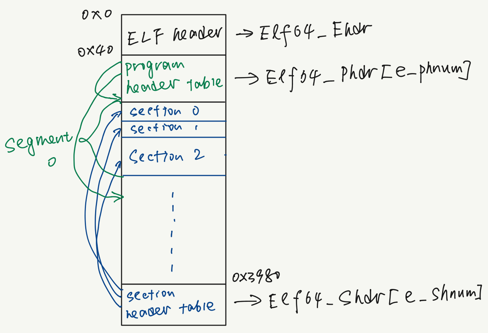

## test0: load a library

### 0-1 Say Hello to ELF
On Linux, dynamic libraries are compiled into ELF(Executable and Linkable Format).
Though there are many articles talking about how ELFs are organized, I will provide a TL;DR version
here:

ELF's minimum functional unit is call a *section*, which starts with a '.', like '.text' (stores code)
and '.data' (stores global variables). To see all the sections of an ELF:

```bash
$ readelf -S ./test_lib/SimpleMul.so

There are 29 section headers, starting at offset 0x3980:

Section Headers:
  [Nr] Name              Type             Address           Offset
       Size              EntSize          Flags  Link  Info  Align
  [ 0]                   NULL             0000000000000000  00000000
       0000000000000000  0000000000000000           0     0     0
  [ 1] .note.gnu.build-i NOTE             0000000000000238  00000238
       0000000000000024  0000000000000000   A       0     0     4
...
  [ 9] .text             PROGBITS         0000000000001040  00001040
       00000000000000cc  0000000000000000  AX       0     0     16
...
```

Several *sections* form a *segment*. Our dynamic linker recognizes each segment, and process them
respectively. You can see what sections a segment contains by:

```bash
$ readelf -l ./test_lib/SimpleMul.so

Elf file type is DYN (Shared object file)
Entry point 0x1040
There are 9 program headers, starting at offset 64

...
 Section to Segment mapping:
  Segment Sections...
   00     .note.gnu.build-id .gnu.hash .dynsym .dynstr .rela.dyn 
   01     .init .plt .plt.got .text .fini 
   02     .eh_frame_hdr .eh_frame 
   03     .init_array .fini_array .dynamic .got .got.plt .data .bss 
   04     .dynamic 
   05     .note.gnu.build-id 
   06     .eh_frame_hdr 
   07     
   08     .init_array .fini_array .dynamic .got 
```
Pretty clear, right?

You can find all sections and segments from *section header table* and *program header table*, in 
*ELF header*. Those terms are terrifying, but we can simply inspecting the ELF header:

```bash
$  readelf -h ../test_lib/SimpleMul.so
ELF Header:
  Magic:   7f 45 4c 46 02 01 01 00 00 00 00 00 00 00 00 00 
  ...
  Start of program headers:          64 (bytes into file)
  Start of section headers:          14720 (bytes into file)
  ...
```
And illustrate it by an image:


Those three headers have their own data structures defined in `<elf.h>` under `/usr/include`, and
`Elf64_Ehdr` which shows the structure of ELF header is like:
```c
typedef struct
{
  ...
  Elf64_Off     e_phoff;		/* Program header table file offset */
  Elf64_Off	    e_shoff;		/* Section header table file offset */
  ...
  Elf64_Half	e_phnum;	    /* Program header table entry count */
  ...
  Elf64_Half	e_shnum;		/* Section header table entry count */
} Elf64_Ehdr;
// Ehdr is short for "ELF header"
```

You can also check [this link](https://www.ics.uci.edu/~aburtsev/238P/hw/hw3-elf/hw3-elf.html),
for a more comprehensive introduction of ELF.

### 0-2 A tour of `mmap`
We've mentioned a lot *mapping a library into memory*, but what on earth does *mapping* means?

In the past lectures, you may learn about virtual memory, which uses pages to manage accessibility
to its contents. In short, so-called mapping is to copy the contents of a file to some pages in
the virtual memory, using system call `mmap`.

**Why do we want to do copy the file into memory?**

Consider we want to access a string in a file at offset `0x100`. If we do not copy the contents into
the memory, we will have to do this:
```c
char buf[STRING_LENGTH];

int fd = open("/path/to/file", O_RDWR);
lseek(fd, 0x100, SEEK_SET);
write(fd, buf, STRING_LENGTH);
```
You can see that we will have to use many functions.

In contrast, if we map the file into memory starting at `0x555555555000`, then we can access the string
simply using address `0x555555555100`.

**Why `mmap`?**

Remember we just talk about different sections in ELF? Generally speaking, we don't want the code of a
library to be modified when it's running, and don't want to interpret global variables into instructions
either. That's exactly when permission in virtual memory comes to the rescue.

A page in the virtual memory is created with certain permissions. There are three common permissions:
read, write and execute. If you violate the permission, *e.g.*, write to a read only page, your program
will receive segmentation fault (SIGSEGV). You will see this a lot in this project :)

Let's get back to `mmap`:

```c
void *mmap(void *addr, size_t length, int prot, int flags, int fd, off_t offset);
```
This function tries to create a page of `length` bytes, from `offset` of file indicated by `fd`, with 
the permission set to `prot`. The mapping falls on `addr` in the virtual memory.

We will see how we can use `mmap` to solve our problem in this test soon.

### 0-3 Finishing test 0
This test only requires you to map a shared library into memory(the location does not matter).
And it is pretty obvious we need to know that:
- Where can I find the file
- Which part of the file needs loading

For the first question, all the testcases come with their absolute path, like `./test_lib/SimpleMul.so`, 
instead of `SimpleMul.so`. If it is the latter case, the loader will need to search for a bunch of directories
to find out where the library is. We will see more about this in the next testcase.

Therefore, find and access this file in your filesystem is quite straightforward now. Just simple C-style file operations.

For the second question, we only need to map those segments (I hope you still remember what it is)
with `p_type` of `PT_LOAD`:
```bash
$ readelf -l ./test_lib/SimpleMul.so

...
# The number of LOAD segment varies under different linkers
Program Headers:
  Type           Offset             VirtAddr           PhysAddr
                 FileSiz            MemSiz              Flags  Align
  # Map these 4 segments
  LOAD           0x0000000000000000 0x0000000000000000 0x0000000000000000
                 0x00000000000004b0 0x00000000000004b0  R      0x1000
  LOAD           0x0000000000001000 0x0000000000001000 0x0000000000001000
                 0x000000000000011d 0x000000000000011d  R E    0x1000
  LOAD           0x0000000000002000 0x0000000000002000 0x0000000000002000
                 0x00000000000000a4 0x00000000000000a4  R      0x1000
  LOAD           0x0000000000002e80 0x0000000000003e80 0x0000000000003e80
                 0x00000000000001a0 0x00000000000001a8  RW     0x1000
  # not this one
  DYNAMIC        0x0000000000002e90 0x0000000000003e90 0x0000000000003e90
                 0x0000000000000150 0x0000000000000150  RW     0x8
  # not this one either
  NOTE           0x0000000000000238 0x0000000000000238 0x0000000000000238
                 0x0000000000000024 0x0000000000000024  R      0x4
...
```
And a segment looks like this in C:
```c
// elf.h
typedef struct
{
  Elf64_Word	p_type;			/* Segment type */
  Elf64_Word	p_flags;		/* Segment flags */
  Elf64_Off	  p_offset;		/* Segment file offset */
  Elf64_Addr	p_vaddr;		/* Segment virtual address */
  Elf64_Addr	p_paddr;		/* Segment physical address */
  Elf64_Xword	p_filesz;		/* Segment size in file */
  Elf64_Xword	p_memsz;		/* Segment size in memory */
  Elf64_Xword	p_align;		/* Segment alignment */
} Elf64_Phdr;
```
To have access to all the segments in an ELF file, we will have to do the following:

First, we need to find out the *ELF header*, or `Elf64_Ehdr` in `<elf.h>`.
It always starts at offset 0 of an ELF file, so use `read()`, `fread()`, or `pread()`
to read `sizeof(Elf64_Ehdr)` number of bytes can find that.

`e_phoff`, `e_phentsize`, and `e_phnum` denote the file offset of program header table,
the size of each entry in program header table, and the number of program headers in it.
Again, you can use the file operation you like to load the table into a buffer,
and then traverse it to get information of each segment.

To sum up, the working order would be:

`Elf64_Ehdr` -> `e_phoff` -> `Elf64_Phdr` -> `p_type`, `p_offset`, ...
 
---
Once you have a pointer to a `LOAD` segment, it's important how we use `mmap` on it.

`p_offset` stores the byte offset where the segment is in the file, and `p_vaddr` indicates 
where this segment should start in virtual memory. When creating mappings, `mmap` requires
the page aligned to the page boundary. (You can get the system page size using `getpagesize()`)

The helper macros `ALIGN_UP` and `ALIGN_DOWN` in `src/MapLibrary.c` is designed for this purpose.

```c
// Elf64_Phdr *first_segment;
// int fd = open(path_to_library);
int prot = 0;
prot |= (first_segment->prot & PF_R)? PROT_READ : 0;
prot |= (first_segment->prot & PF_W)? PROT_WRITE : 0;
prot |= (first_segment->prot & PF_X)? PROT_EXEC : 0;
// NULL means "allow OS to pick up address for you"
void *start_addr = mmap(NULL, ALIGN_UP(first_segment->p_memsz, getpagesize()), prot, 
     MAP_FILE | MAP_PRIVATE, fd, ALIGN_DOWN(first_segment->offset, getpagesize()));
```
Few things you need know:

- `PF_R` is used to signify a *segment* has read permission,
while `PROT_READ` is used to show a *virtual memory page* has read permission.
We need to convert that before calling `mmap()`.

- `mmap()` has alignment requirement, expecting the beginning and end of this call 
exactly on a page boundary. As a result, you may want to double check if `addr`,
`addr + length` and `offset` is well aligned if you find `mmap` return `-1` (or `0xfff...`).

<!-- - Due to the *position-independent* feature, code in shared library often use PC-relative
address to access a function/variable. This implicitly demands segments to be mapped at
the address according to the program header table(remember VirtAddr?). 
Though the address of the first mapping does not matter(like `NULL` above), 
the following mappings probably need fixed address. -->

- Start address of each segment. You should map the first segment using `NULL` as the first argument to
`mmap`, because this allows the kernel to pick a address that is not in-use. Note that you cannot
let all the segments pick arbitrary address, because segments would use a fixed offset to access
each other. However, we also want to retain the *position-independent* feature of shared libraries
(see textbook 7.12). This means that the first segment should be `mmap`ed with `NULL`, and 
the remaining consistent to the previous one. **To achieve this, you should remain enough space**
**when trying to `mmap` the first segment, otherwise the remaining segments won't fill.**
Check how `MAP_FIXED` in `flags` creates a new mapping on a piece of memory that may already 
have memory mappings.

<!-- ubuntu 16.04/18.04 will pass even NULL is used from the beginning to the end
while 20.04 won't. That's why I decide not to keep MAP_FIXED as a secret (nobody discover this, tho).
In this case it would be unfair to those using 20.04. So I write here to use MAP_FIXED here,
and use "reserve enough space" as a challenge.
-->
<!-- TODO: check all-NULL mappings and fail this solution. (hard tho) -->

---
Getting back to what you need to implement: 

0. Find and open the required file, then following the aforementioned order to access each segment: 
`Elf64_Ehdr` -> `e_phoff` -> `Elf64_Phdr` -> `p_type`, `p_offset`, ...

<!-- The internal data structure `LinkMap` in `src/Link.h` is designed to share info among all modules.
Check the comments in that file to learn what all the fields mean. -->

1. Use `mmap` to map the first `LOAD` segment, and store its start address in `LinkMap`->`addr`.
You can check the meaning of each field from the inline comments in `src/Link.h`.

2. Map the remaining `LOAD` segments tightly following their previous one.

3. Find the dynamic segment, and store its absolute address in `LinkMap`->`dyn`.

4. Call the helper function once you are sure the previous steps are well handled.

Congrats! You've finished 80% of this project!
